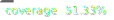

串接的政府的[資料來源](https://ptx.transportdata.tw/MOTC/)

# 高鐵時刻表

輕量化的高鐵時刻表班次快速查詢網頁

## Installation

Make sure you have Node.js and npm installed.

## Available Scripts

In the project directory, you can run the following npm scripts:

### Development

#### Start

Starts the development server using Vite.

### Building

#### Build

Builds the project for production.

#### Preview

Creates a production preview of the built project.

### Testing

#### Test

Runs the test suite using Vitest.

#### Coverage

Runs tests with coverage reports.

#### Test Summary

Generates a test summary with coverage and outputs the reports in JUnit and JSON format.

### Additional Scripts

#### Make Badges

Generates coverage badges using coverage-badges.

#### Predeploy

Runs the build process before deployment.

## Usage

- Use `npm start` to run the development server.
- Execute `npm run test` to run tests using Vitest.
- Run `npm run build` for production builds.
- Check coverage with `npm run coverage`.
- Generate coverage reports using `npm run test:summary`.
- Utilize other scripts as needed for formatting, deployment, and preview.
